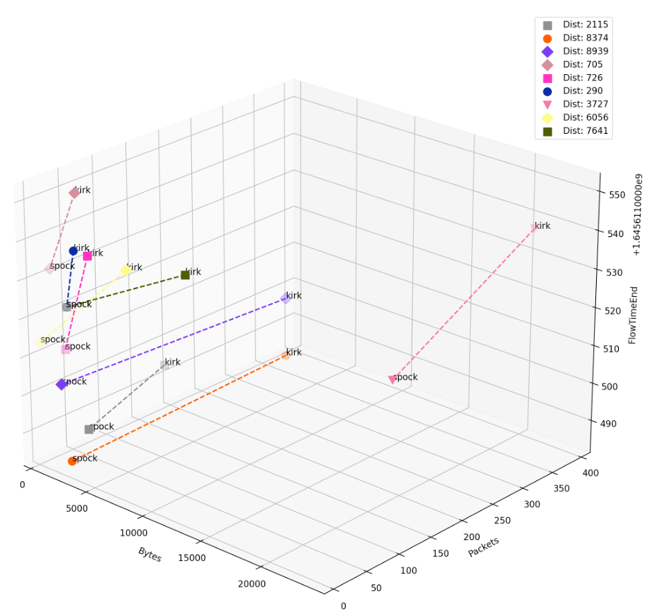

# netflow-duplication-recognizer
[](https://github.com/GIScience/badges#experimental)
[](https://www.python.org/)
[](https://github.com/Naereen/StrapDown.js/blob/master/LICENSE)


<br/>
For recognicing of netflow dublications. Based on data generated with <a href="https://github.com/bwNetFlow/flowpipeline">bwNetFlow/flowpipeline</a>.<br/> <br/>This tool filters your flows based on:
<ol>
  <li>protocol</li>
  <li>port-combination</li>
  <li>similarity of flow-vectors "packages/bytes/?"-Tuple</li>
  <li>ip addresses (destination addresses) - check if they are equal</li>
</ol>

<br/>


## Before you can start
You need flows of two differnt sources.

## Getting Started
Install the requirements for this prorgam.
```bash
pip install -r requirements.txt
```
Select the sorucefiles of your flows in json format.
 ```bash
python3 main.py -1 sourceA.json -2 sourceB.json
```
#### Using flags
```
  -h show help
  -1 sourcefile of flows in json format
  -2 sourcefile of flows in json format
  -o targetfile for duplicates flows in json format (if none -> no output data)
  -p protocol filter for tcp/udp | udp is standard
  -v if you want to plot the results - True/False | true is standard
```
```bash
# example for getting flows of dumpA and dumpB, analysing udp, plotting it and save the duplicates in outfile.json
$ python3 main.py -1 jsonData/b.json -2 jsonData/a.json -p tcp -v True -o outfile.json
```
## Inside the code
```python
# returns all portcombinations of tcp flows
tcpPortList = tcpPort.returnPortList()

# generate vector based on defined files in distance.py
def convertToVector(self, netflow):
    return (netflow["id"], netflow["Bytes"],netflow["Packets"], netflow["TimeReceived"])

# you can choose between euclidean, manhatten or cosine (works bad) similarity in the main.py
distanceOfFlowsObj = distanceOfFlowsObj.euclidean(flowList)

# for plotting the ids of the flows, change following line in the plotDist.py
self.ax.text(xs[i], ys[i], zs[i], netflows[i]["loc"])
# to
self.ax.text(xs[i], ys[i], zs[i], netflows[i]["loc"]+" [" + str(netflows[i]["id"])+"]")

# for analysing only few flows, you can use following lines in the main.py
# the program will only iterate through 15 port combinations 
if breakUpCounter == 15: 
    break
```
## Example of plotting some duplicated flows

Explenation: The different geometry symbols show different port combinations.


